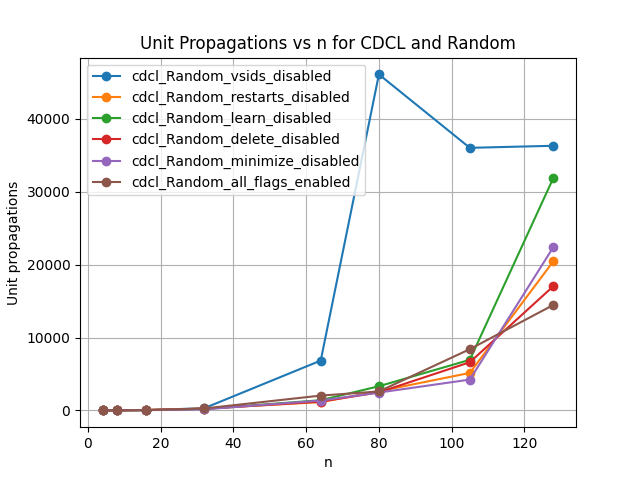
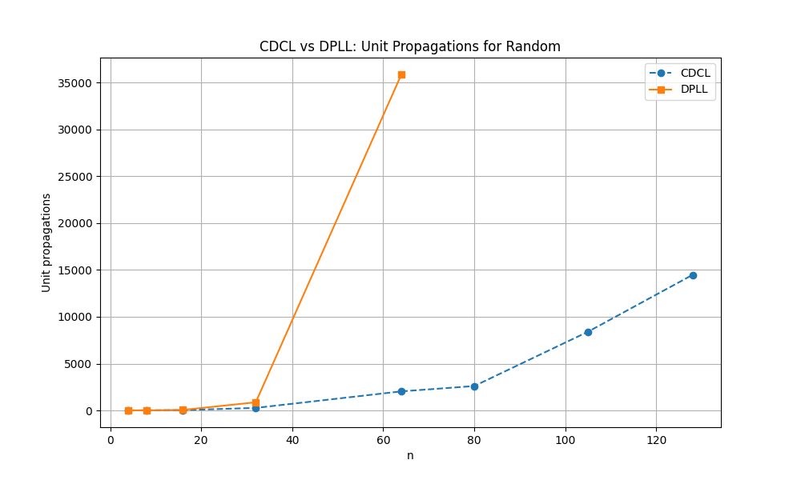

# SAT Solver Performance Analysis

This document presents a comprehensive analysis of the performance of CDCL (Conflict-Driven Clause Learning) and DPLL (Davis–Putnam–Logemann–Loveland) SAT solvers across various problem types and configurations.

## Table of Contents
1. [Random 3-SAT Problems](#random-3-sat-problems)
2. [Pigeonhole Principle (PHP) Problems](#pigeonhole-principle-php-problems)
3. [Pebbling Problems](#pebbling-problems)
4. [CDCL vs DPLL Comparison](#cdcl-vs-dpll-comparison)

## Random 3-SAT Problems

### CDCL Solver Performance

#### Execution Time

This graph shows the execution time of the CDCL solver on random 3-SAT problems with different configurations.

#### Unit Propagations

This graph illustrates the number of unit propagations performed by the CDCL solver on random 3-SAT problems.

#### Decisions

This graph displays the number of decisions made by the CDCL solver on random 3-SAT problems.

### DPLL Solver Performance

#### Execution Time

This graph shows the execution time of the DPLL solver on random 3-SAT problems.

#### Unit Propagations

This graph illustrates the number of unit propagations performed by the DPLL solver on random 3-SAT problems.

#### Decisions

This graph displays the number of decisions made by the DPLL solver on random 3-SAT problems.

## Pigeonhole Principle (PHP) Problems

### CDCL Solver Performance

#### Execution Time

This graph shows the execution time of the CDCL solver on PHP problems with different configurations.

#### Unit Propagations

This graph illustrates the number of unit propagations performed by the CDCL solver on PHP problems.

#### Decisions

This graph displays the number of decisions made by the CDCL solver on PHP problems.

### DPLL Solver Performance

#### Execution Time

This graph shows the execution time of the DPLL solver on PHP problems.

#### Unit Propagations

This graph illustrates the number of unit propagations performed by the DPLL solver on PHP problems.

#### Decisions

This graph displays the number of decisions made by the DPLL solver on PHP problems.

## Pebbling Problems

### CDCL Solver Performance

#### Execution Time

This graph shows the execution time of the CDCL solver on pebbling problems with different configurations.

#### Unit Propagations

This graph illustrates the number of unit propagations performed by the CDCL solver on pebbling problems.

#### Decisions

This graph displays the number of decisions made by the CDCL solver on pebbling problems.

### DPLL Solver Performance

#### Execution Time

This graph shows the execution time of the DPLL solver on pebbling problems.

#### Unit Propagations

This graph illustrates the number of unit propagations performed by the DPLL solver on pebbling problems.

#### Decisions

This graph displays the number of decisions made by the DPLL solver on pebbling problems.

## CDCL vs DPLL Comparison

### Random 3-SAT Problems

#### Execution Time Comparison

This graph compares the execution time of CDCL and DPLL solvers on random 3-SAT problems.

#### Unit Propagations Comparison

This graph compares the number of unit propagations performed by CDCL and DPLL solvers on random 3-SAT problems.

#### Decisions Comparison

This graph compares the number of decisions made by CDCL and DPLL solvers on random 3-SAT problems.

### Pigeonhole Principle (PHP) Problems

#### Execution Time Comparison

This graph compares the execution time of CDCL and DPLL solvers on PHP problems.

#### Unit Propagations Comparison

This graph compares the number of unit propagations performed by CDCL and DPLL solvers on PHP problems.

#### Decisions Comparison

This graph compares the number of decisions made by CDCL and DPLL solvers on PHP problems.

### Pebbling Problems

#### Execution Time Comparison

This graph compares the execution time of CDCL and DPLL solvers on pebbling problems.

#### Unit Propagations Comparison

This graph compares the number of unit propagations performed by CDCL and DPLL solvers on pebbling problems.

#### Decisions Comparison

This graph compares the number of decisions made by CDCL and DPLL solvers on pebbling problems.

### Short Evaluation:

- **PHP**: Starting from \( n = 8 \), PHP runs too long in my implementation.
- **Pebbling**: Pebbling runs significantly better with CDCL as expected in theory.
- **DPLL**: Unexpectedly, Pure Literal Elimination makes DPLL slower, at least in my implementation.
- **VSIDS and Restart**: These are crucial for PHP.
- **VSIDS**: Generally, VSIDS is important, even for Random. Some runs take significantly longer when VSIDS is disabled, causing the average to spike (sometimes up to 20 times longer).
